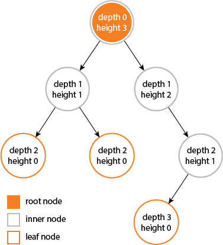
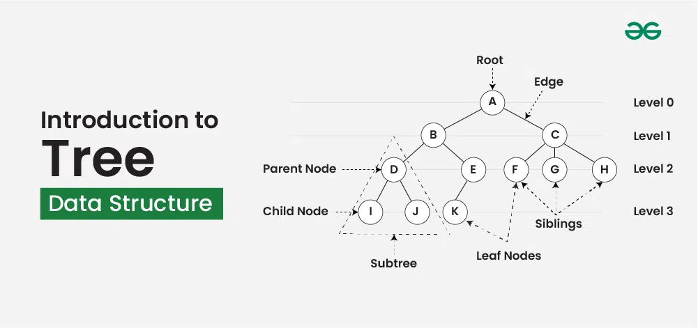
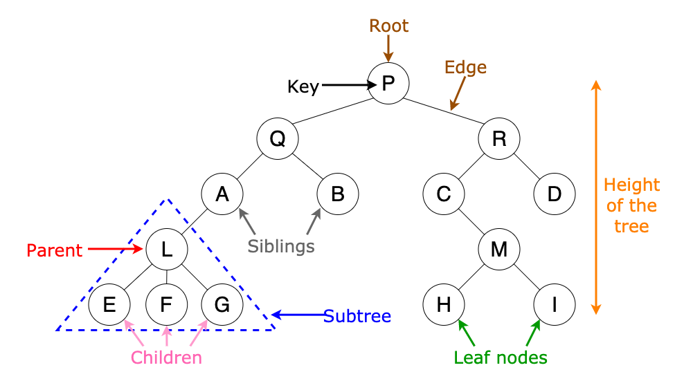
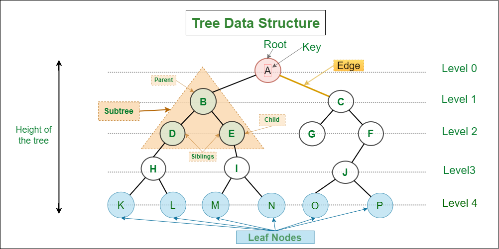

## Trees

# 1- What is a Tree?

# 2-A tree is a non-linear data structure that consists of nodes.

# 3-It is a collection of nodes organized in a hierarchical structure.

# 4-The topmost node is called the root.

# 5-Each node can have zero or more child nodes.

# 6-A tree does not contain cycles

The Tree data structure can be useful in many cases:

Hierarchical Data: File systems, organizational models, etc.
Databases: Used for quick data retrieval.
Routing Tables: Used for routing data in network algorithms.
Sorting/Searching: Used for sorting data and searching for data.
Priority Queues: Priority queue data structures are commonly implemented using trees, such as binary heaps.

Tree Terminlogy
1 Root Node
2 child Node
3 Siblings
4 Leaf Nodes
5 Internal nodes
6 Ancestor node
7 Descendant
8 Edges
9 Height
10 Depth

Here's the explanation in markdown format for your `README.md`:

```markdown
# Tree Terminology

This document explains the basic terminology used in tree data structures.

## 1. Root Node

The **Root Node** is the topmost node in a tree. It has no parent and is the starting point of the tree structure.
```

     A (Root Node)
    / \

B C

```

## 2. Child Node
A **Child Node** is a node that is a descendant of another node. A node can have multiple child nodes.

```

     A
    / \

B C

```
In this diagram, B and C are **child nodes** of A.

## 3. Siblings
**Siblings** are nodes that share the same parent.

```

     A
    / \

B C

```
Here, B and C are **siblings** because they both have A as their parent.

## 4. Leaf Nodes
**Leaf Nodes** are nodes that do not have any children. They are the terminal nodes in the tree.

```

     A
    / \

B C
/ \
 D E

```
In this example, B, D, and E are **leaf nodes** because they don't have any children.

## 5. Internal Nodes
**Internal Nodes** are nodes that have at least one child. They are not leaf nodes.

```

     A
    / \

B C
/ \
 D E

```
Here, A and C are **internal nodes** because they have children, while B, D, and E are leaf nodes.

## 6. Ancestor Node
An **Ancestor Node** of a given node is any node that lies on the path from the root to that node. The root is an ancestor of every other node.

```

     A
    / \

B C
/ \
 D E

```
For node D, the **ancestor nodes** are A and C. A is the root and the ultimate ancestor.

## 7. Descendant
A **Descendant** of a node is any node that can be reached by following the edges downward from that node.

```

     A
    / \

B C
/ \
 D E

```
For node A, the **descendant nodes** are B, C, D, and E. For node C, the descendants are D and E.

## 8. Edges
An **Edge** is a connection between two nodes. It is a link that connects a parent node to its child node.

```

     A
    / \

B C

```
In this tree, there are two **edges**: one connecting A to B, and another connecting A to C.

## 9. Height
The **Height** of a node is the number of edges on the longest path from that node to a leaf. The height of the tree is the height of the root node.

```

     A
    / \

B C
/ \
 D E

```
The **height** of node A is 2 (the longest path to a leaf is through C to either D or E). The **height** of leaf nodes B, D, and E is 0.

## 10. Depth
The **Depth** of a node is the number of edges from the root node to that node. The depth of the root node is 0.

```

     A
    / \

B C
/ \
 D E

```
The **depth** of node A is 0 (since it is the root). The **depth** of node B is 1, and the **depth** of nodes C, D, and E is 1 and 2, respectively.

---

This terminology helps define the structure and relationships within tree data structures in computer science.
```







